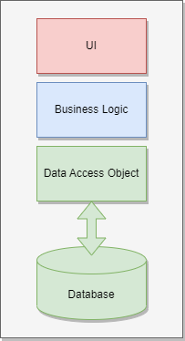
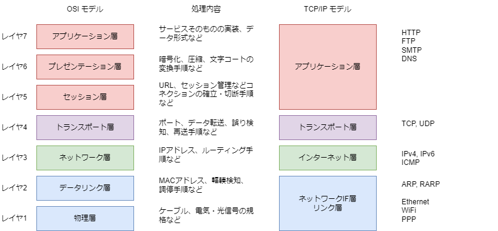
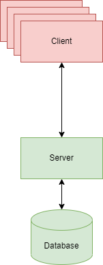
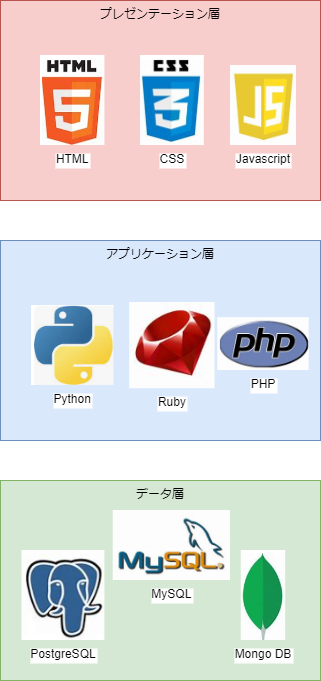
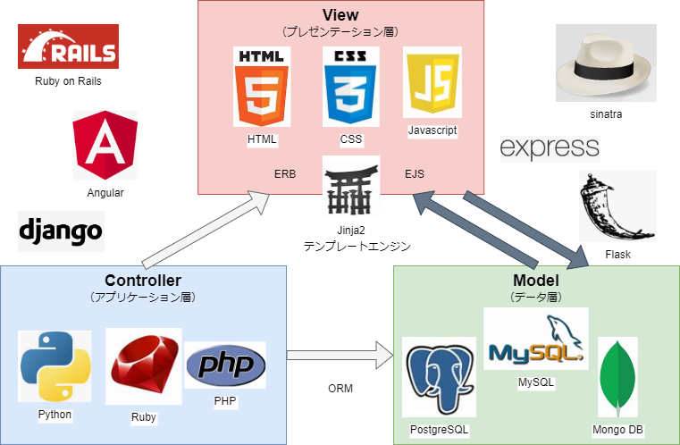
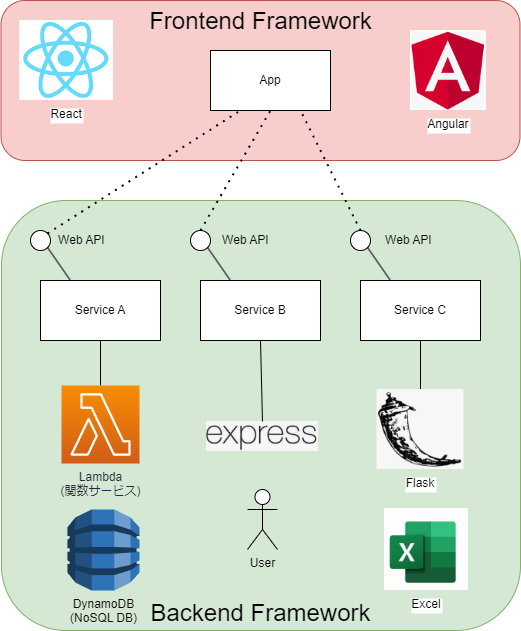

# ソフトウェア開発手法 2

## 前回のおさらい
ソフトウェアの開発手法の一つとして、**ウォーターフォールモデル** があり、要求分析、要件定義、基本設計、詳細設計、実装といった工程があることを学んだ。
また、ウォーターフォールモデルの欠点として、要求分析や要件定義の段階で、ユーザーの要求を正確に把握できないことがあることを学んだ。解決策として、開発中に柔軟に仕様を変更することが可能な **アジャイルモデル** で進める方法もあるが、ウォータフォールモデルの工程を適切に管理できる方法を模索する。ここでは、その後の開発を進める方針を決定付ける基本設計を行う上で重要な概念である **システムアーキテクチャ** について学ぶ。
システムアーキテクチャを学ぶことで、システムを俯瞰的に眺めることが出来るようになり、部分最適とならないあるべき姿を目指したシステムを構築することができるようになる。

## 基本設計
システムを構成する **各要素（モジュール、コンポーネント、サービスなど）間の連携動作** を明確に記述するドキュメント。システム構成や機能の詳細を俯瞰して記述することから、**外部設計**、**システム設計**、**構造設計** とも呼ばれる。
基本設計を検証するテストとしては、**結合テスト** と呼ばれ、各要素が連携して動作することを検証できる項目となる。

## ドキュメントの内容
基本設計書の例として、以下のような項目がある。
- **システム構成**
- **ネットワーク設計**
- **データベース設計**
- **機能一覧**
- **画面構成**
- インターフェース設計
- データ構造
- プログラム構成
- セキュリティ設計
- コンプライアンス設計
- SDGs設計
など、が挙げられる。
プロジェクトにより異なるが、**システム構成、ネットワーク設計、データベース設計** はどの様な考えでシステムを構築しようとしているかを明確にするドキュメントであり、基本設計書の中核となるドキュメントである。また、**機能一覧、画面構成** は、要件を一覧し抜け漏れを無くす意味で必ず含めるべきドキュメントと言える。

## システムアーキテクチャ
システム構成、ネットワーク設計、データベース設計は、システムの構造や構成要素を決めだけではなく、それらの相互関係に大きく影響しシステムの振る舞い自体を定義することから、**システムアーキテクチャ** と呼ばれることもある。
システムアーキテクチャがシステムの振る舞い自体を定義するということから、**システムの良し悪しを決める最重要検討事項** と位置付けられている。
しかし、重要ではあるが、考慮すべき概念が多く、また、システムの根本的な部分でもあるため開発開始後に変更することが難しい。そのため、通常は開発者の経験や知識のみに頼らず、過去のソフトウェア開発の膨大な失敗と成功体験により蓄積された知見を利用し進めることが多い。
以下に、システムアーキテクチャの例を示すが、適用するシステム毎に異なるため、あくまで一例であることに注意すること。

### モノリシックアーキテクチャ（Monothilic Architecture）
システムの構成を分割せず、１つのシステムとして構築することで、一貫した思想で開発を行う概念である。
メリットとしては、システムの構成がシンプルであるため、開発者の知識が少なくても開発が可能であることが挙げられる。また、部分最適を行いやすく、高い応答性能や高い処理再現性を実現し易い。
デメリットとしては、システムの規模が大きくなると、開発者の知識が増えるため、開発者の知識が少ない場合、開発が困難になることが挙げられる。また、これは初版の開発者の設計思想がシステムに強く影響を与えやすく、別の開発者がシステムを引き継ぎ難いといった問題も誘発し易い。

適用しやすいシステム例：システムの変更が頻繁ではない小規模な組込み系システム、シビアな応答性がIoTシステムなど

### レイヤードアーキテクチャ（Layered Architecture）
システムの構成を **レイヤー** と呼ばれる単位で分割し、各レイヤーの役割を明確にすることで、システムの保守性を高めることができる。レイヤーは、システムの構成を分割する単位であり、各レイヤーは、上位レイヤーから下位レイヤーへの依存関係を持つ。レイヤーは、上位レイヤーから下位レイヤーへの依存関係を持つことから、上位レイヤーの変更が下位レイヤーに影響を与えることはあっても、下位レイヤーの変更が上位レイヤーに影響を与えることはない。これにより、システムの保守性を高めることができる。
メリットとしてはレイヤー毎に開発者を分けたり、レイヤー毎に入手先を変更するといった分業を柔軟に行うことが可能な点が挙げられる。この特徴から、汎用的なネットワークプロトコルの実装に広く採用されている。
デメリットとしては、分業可能なため、開発側のノウハウがレイヤー毎に分散しやすく、システム全体の把握が難しくなることが挙げられるが、対策の選択肢は多く、メリットを打ち消すほど大きな問題とはならないことが多い。

適用し易いシステム例：ネットワークプロトコルの実装、OSの実装、WEBシステムなど

### クライアント・サーバーアーキテクチャ（Client-Server Architecture）
システムの構成を **クライアント** と呼ばれるユーザーとシステムのインターフェースを担当する部分と、**サーバー** と呼ばれるクライアントからの要求を受け付け、処理を行い、結果をクライアントに返す部分に分割することで、システムの保守性を高めることができる。クライアントとサーバーは、ネットワークを介して通信を行うことで、システムを構成する。
メリットとしては、クライアントとサーバーで役割を分担するため、独立して開発することが可能であり、また、通信を介して疎に結合したシステムを構築し易く、これが保守性の向上につながる。
デメリットとしては、クライアントとサーバーの通信が必須となるため、通信が不安定な環境では、システムの動作が不安定になることが挙げられる。また、基本的にはクライアントからの要求にサーバーが応える形での実装となるため、サーバー側の負荷が高くなった場合の対応が難しいことが挙げられる。

適用し易いシステム例：速度応答が厳しくないWEBシステム、スマートフォンアプリケーションなど

### 多層アーキテクチャ（Multi-Tier Architecture） 
システムアーキテクチャの中でも、多層アーキテクチャは、システムの構成を分割し、各層の役割を明確にすることで、システムの保守性を高めることができる。

以下は **３層アーキテクチャ** の例である。
- プレゼンテーション層
- アプリケーション層
- データ層

**プレゼンテーション層** は、ユーザーとシステムのインターフェースを担当する層であり、ユーザーからの入力を受け付け、システムからの出力をユーザーに表示する。ブラウザーの画面や、スマートフォンのアプリケーション画面が該当し、ユーザーが直接操作する部分である。WEBシステムの場合、HTMLやCSSを基本に、JavaScript、TypeScript などの **ユーザーエクスペリエンス(UX)** を向上させ易い開発言語を用いることが多い。

**アプリケーション層** は、ユーザーからの入力を受け付け、データ層からデータを取得し、データ層にデータを保存する。論理層・業務層・サービス層などと呼ばれることもある。プレゼンテーション層から集めた情報を特定のルールに基づき処理を行う、**ビジネス・ロジック** を実行する場所である。WEBシステムの場合JavaやPython、Ruby、PHPなどデータベース操作をし易い開発言語を用いることが多い。

**データ層** は、データベースを管理する層であり、データの保存や取得を行う。定型的なデータを扱う場合、**リレーショナルデータベース** である、MySQLやPostgreSQL、Oracleなどを用いることが多く、JSONや時系列データ、ドキュメントデータなどの非定型データを扱う場合、NoSQL データベースに分類される、MongoDBやElasticsearchなどの **NoSQLデータベース** を用いることが多い。

【補足】ここで言う層（Tier）はネットワークプロトコルなどに用いられるレイヤー（Layer）とは異なる概念である。レイヤーは論理的に分離する概念だが、層は物理的にも、論理的にも概念的に分離している。レイヤーは、論理的に分離することで、変更に強いシステムを構築することを目的としているが、層は、物理的に分離することで、システムの保守性を高めることを目的としている。この概念はオンプレとクラウドのサービスの違いを理解する上で重要である。

メリットとしては物理的に分離することで、システムの保守性を高めることができる。また、各層の役割が明確になるため、開発者の知識が少なくても開発が可能であることが挙げられる。
デメリットとしては、各層に開発ノウハウが分散しやすく、システム全体の把握が難しくなることが挙げられるが、対策の選択肢は多く、メリットを打ち消すほど大きな問題とはならないことが多い。

適用し易いシステム例：WEBシステム、スマートフォンアプリケーションなど

### MVCアーキテクチャー（Model-View-Controller Architecture）
WEBシステムの開発において、多層アーキテクチャを適用する場合、**MVCアーキテクチャ** と呼ばれる概念が用いられることが多い。

**モデル**：データ層に該当する部分であり、データの保存や取得を行う。

**ビュー**：プレゼンテーション層に該当する部分であり、ユーザーとシステムのインターフェースを担当する部分である。

**コントローラー**：アプリケーション層に該当する部分であり、ユーザーからの入力を受け付け、データ層からデータを取得し、データ層にデータを保存するビジネス・ロジックを実行する。

メリットとしては、UIとビジネスロジック、データベース処理を独立させることができるため、分散開発が容易であることが挙げられる。また、全面的にMVCモデルの考え方を導入していると謳う開発環境も多く、情報収集が容易であることが挙げられる。
デメリットとしては、概念としては非常にシンプルであるが、実装としては非常に複雑であるため、導入のための学習コストが高いことが挙げられる。実際、フル実装である、Ruby on Rails、Angular、Djangoなどのフレームワークは、学習コストが高いことで知られている。逆に、学習コストが低いフレームワークでも、MVCモデルの考え方を導入することは可能だが、実装は各自行う必要がある。

適用し易いシステム例：WEBシステム、スマートフォンアプリケーションなど

### マイクロサービスアーキテクチャ（Microservice Architecture）
実際のソフトウェア開発においては、スピードが求められることが多いことから、生産性・品質の向上が見込まれるライブラリ、テンプレートなどが事前設定済みの開発フレームワークを導入することが多い。WEBシステムの場合、ユーザーとシステムのインターフェースを担当する **フロントエンド・フレームワーク**、ビジネスロジックとデータベース管理を行いアプリケーション層を **バックエンド・フレームワーク** と呼ぶこともある。
フロントエンドのフレームワークとしては、ReactやVue.js、Angularなどがあり、バックエンドのフレームワークとしては、Spring BootやDjango、Ruby on Railsなどがある。

フロントエンド・フレームワークとバックエンド・フレームワークを組み合わせて開発を行う場合、フロントエンド・フレームワークとバックエンド・フレームワークの間でデータのやり取りを行う必要がある。このデータのやり取りを行うため **API** を定義することで、フロントエンド・フレームワークとバックエンド・フレームワークを疎に結合したシステムを構築することができる。このようなシステムを構築するアーキテクチャを **マイクロサービスアーキテクチャ** と呼ぶことがある。

メリットとしては、フロントエンド・フレームワークとバックエンド・フレームワークを疎に結合することができ、サービスのつなぎ替えや拡張が容易であるため、別々のチームでの開発も容易である。また、サービスを増やす要領で、サービスの二重化を行うことも容易でありく、耐障害性に優れたシステムを構築することができる。
デメリットとしては、お互い疎であるが故に、サービスが無秩序に増えすぎると、サービスの依存関係が複雑になり、システムとしての統合が難しくなる傾向があることが挙げられる。この問題は、サービスを統合・管理するオーケストレーション、インフラをコード化しサービスのデプロイを自動化する IaS（Infrastructure as Code）や CI/CD（Continuous Integration and Continuous Delivery）といった技術で解決することができる。

