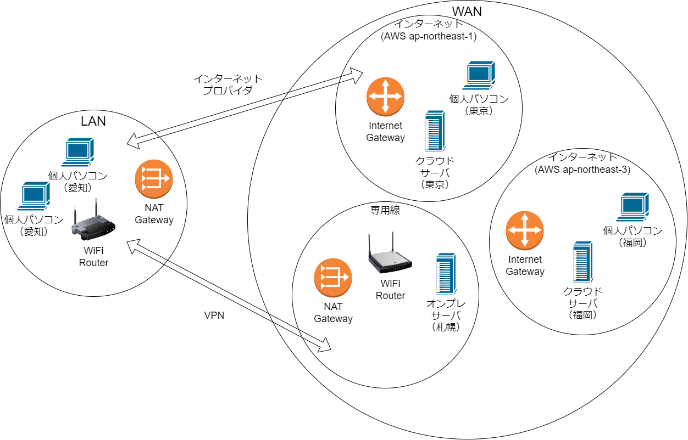
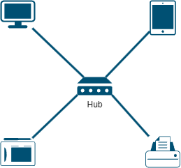
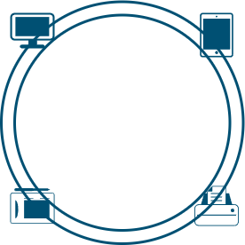

# ソフトウェア開発手法 3

## 前回のおさらい
前回まで、ソフトウェア開発手法としてウォーターフォールモデル、アジャイル開発、スクラムなどがあることを学んだ。また、ソフトウェアの基本設計を行う際、ソフトウェア開発手法にとらわれることなく、プロジェクトの性質に合わせて適切なソフトウェアアーキテクチャを選択することが重要であることを学んだ。
今回は、ネットワーク設計について学んでいく。

# ネットワーク設計
ネットワーク設計とは、ネットワークの構築において、どのようなネットワーク機器を使用するか、どのようなネットワーク構成にするか、どのようなネットワークプロトコルを使用するかなどを決定することである。
特に日本においては、対災害性への関心の高さから、事業継続性（**BCP**: Business Continuity Plan）の観点から、自前のサーバーで運用していた（オンプレミス）サービスを**クラウドへ移行**する事案が増えてきている。また、モノのインターネット（**IoT**: Internet of Things）の普及により、従来、対象外とされてきた小さな機器が大量にインターネットに接続され、セキュリティ対策のためのオンライン更新（**OTA**: Over The Air）の考慮がネットワーク設計を行う上で重要な要素となってきている。

## ネットワーク設計の種類
ネットワーク設計は、以下の3つの利用範囲で分類される。

1. ローカルエリアネットワーク（LAN）設計: 限られた地理的範囲内で使用されるネットワーク。通常、オフィスや学校などの建物内で使用される。

1. ワイドエリアネットワーク（WAN）設計: 広範な地理的範囲で使用されるネットワーク。異なる地域や国を結ぶために使用される。

1. インターネット設計: 世界中のコンピュータネットワークを相互接続するグローバルなネットワーク。インターネットへの接続やセキュリティの確保などが重要な要素となる。

注意：広義な意味では、ハード内におけるごく限られた範囲で行われる、CPU-CPU間、CPU-デバイス間、デバイス-デバイス間の通信もネットワークに含まれる。これらの通信は、CPUやデバイスのスペックに大きく依存し、組込みソフト開発の範囲に含まれるため、ここでは触れない。

重要なことは、使用する地理的な範囲の違いによって、異なるネットワーク設計が必要となる点である。

## ネットワークトポロジーの種類
ネットワークトポロジーとは、ネットワーク機器同士の接続方法を示したものである。代表的なネットワークトポロジーには、以下のような種類がある。

1. バス型トポロジー: ネットワーク機器を一本のケーブルで接続するトポロジー。ネットワーク機器が一つのケーブルに接続されているため、故障が発生するとネットワーク全体に影響が出る。単純な構造であり、低コストで構築できるため、小規模なネットワークで使用されることがある。同軸ケーブルや10BASE2などで使用されている。現在はあまり使用されていない。

1. スター型トポロジー: ネットワーク機器を中央のハブやスイッチに接続するトポロジー。ネットワーク機器同士が直接接続されていないため、故障が発生しても影響が出にくい。ネットワークハブで使用されており、現在、最も一般的に使用されているトポロジーである。

1. リング型トポロジー: ネットワーク機器をリング状に接続するトポロジー。データはリングを周回して送受信されるため、故障が発生してもデータが回り続ける限り影響が出にくい。トークンリングやFDDI（Fiber Distributed Data Interface）などで使用されているが、現在はあまり使用されていない。

1. メッシュ型トポロジー: ネットワーク機器同士が全てのネットワーク機器と接続されているトポロジー。故障が発生しても他のネットワーク機器と通信できるため、高い信頼性を持つ。ただし、ネットワーク機器同士の接続が多くなるため、コストがかかる。また、管理が複雑になるため、大規模なネットワークで使用されることが多い。

## ネットワークプロトコルの種類
ネットワークプロトコルとは、ネットワーク機器同士が通信するための規約である。ネットワークプロトコルには、以下の様に多くの種類がある。

インターネットを利用するために必須のプロトコルとして
1. **TCP/IP**・**UDP/IP**: インターネットの基盤となるプロトコルであり、Webブラウザやメールソフトなどのアプリケーションが使用する。パケット単位でやり取りを行うIPを利用し、TCPは再送による信頼性、UDPはTCPよりリアルタイム性があるといった特徴がある。
1. **HTTP**: ウェブページの閲覧やファイルのダウンロードなどに使用される。クライアントからサーバーへのリクエストと、サーバーからクライアントへのレスポンスのやり取りを行う、サーバークライアント型のプロトコル。
1. **FTP**: ファイルのアップロードやダウンロードなどに使用される。
1. **POP3・SMTP**: メールをやり取りするためのプロトコル。
1. **IMAP**: メールを受信するためのプロトコル。メールをローカルPCにダウンロードして参照するPOP3に対し、メールサーバーに保存されたままメールを参照する点が異なる。

また、近年、IoTの普及により、相互接続性・通信速度・帯域幅・セキュリティなどの要件が増えてきており、新たなプロトコルの開発が進んでいる。
1. **MQTT**/**WebSocket**/**CoAP**: HTTPなどに比べパケットが小さく、割込み駆動が可能で省電力化が見込めるプロトコル。
1. **LoRaWAN**/**Sigfox**: 長距離での低消費電力のデバイス間通信を可能にするプロトコル。
1. **Zigbee**/**BLE**: 短距離での低消費電力のデバイス間通信を可能にするプロトコル。

## ネットワークセキュリティの種類
ネットワークセキュリティとは、ネットワーク上での情報を保護するための対策である。サーバーの保守管理などの運用から、ソフトウェアの設計、データの管理など対策が多岐にわたるため、一言でいうことは難しいが、大雑把に、**脅威の遮断、脅威からのデータ保護、障害からの早期復旧**に分けて考えることができる。

### 脅威の遮断
サービスに対する不正なアクセスを遮断するための根本対策。
1. **認証**: ユーザー名/パスワード、多要素認証（MFA: Multi-Factor Authentication）などによるアクセス制限。
1. **証明書**: 本人確認のための証明書を使用することで、不正なアクセスを遮断する。
1. **ファイアウォール**: 特定のIPアドレス、ポート番号、プロトコルなどによるアクセス制限。地域や国を限定したり、時間帯によるアクセス制限を行うこともある。
1. **NAT**: プライベートIPアドレスをグローバルIPアドレスに変換することで、外部からのアクセスを制限する。
1. **プロキシ**: クライアントとサーバーの間に立ち、クライアントからのアクセスを制限する。
1. **VPN**: インターネット上でプライベート接続と同等の使用感を実現しつつセキュリティを向上させる。

### 脅威からのデータ保護
万が一、サービスが脅威にさらされてしまった際に被害を最小限に抑える対策。
1. **HTPS**: HTTPの拡張規格。ウェブブラウザとウェブサーバー間でデータを暗号化するためのプロトコル。
1. **SSH**: ネットワーク機器にリモートでアクセスするために使用される。
1. **SSL**/**TLS**: インターネット上でデータを暗号化するために使用される。
1. **IPsec**: インターネット上でデータをIPパケットのレベルで暗号化するために使用される。

### 障害からの早期復旧
サービスが脅威にさらされたことをいち早く検知し、サービスの復旧を早める対策。
1. **DDoS対策**: 大量のアクセスを受けた際にサービスを維持するための対策。
1. **IDS/IPS**: ネットワーク上での不正なアクセスをOSなどプラットフォームレベルで検知する仕組み。
1. **WAF(Web Application Firewall)**: ファイアウォール、IPSなどで防げない、データの中身を解析し攻撃を検知する仕組み。
1. **冗長化**: サービスを複数のサーバーで運用することで、サービスの復旧を早める。データを物理的・論理的に複製することで、データの復旧を早める。

## （補足）開発側のセキュリティ対策

### 開発時のセキュリティ対策
1. **CSRF**: クロスサイトリクエストフォージェリ。ユーザーが意図しないリクエストを送信することで、不正な操作を行う攻撃。
1. **XSS**: クロスサイトスクリプティング。ウェブサイトにスクリプトを埋め込むことで、ユーザーの情報を盗む攻撃。
1. **CORS**: クロスオリジンリソース共有。異なるオリジン間でのリソース共有を制限する。
1. **SQLインジェクション**: SQL文に不正なコードを埋め込むことで、データベースを操作する攻撃。
1. **セッションハイジャック**: セッションIDを盗み、不正な操作を行う攻撃。
1. **クリックジャッキング**: クリックされたと思わせる画面を表示し、ユーザーに意図しない操作を行わせる攻撃。

### コンパイル・ビルド時のセキュリティ対策
1. **脆弱性診断ツール**: セキュリティの脆弱性を診断するツールを使用することで、セキュリティの脆弱性を見つける。
1. **イメージスキャン**: イメージに含まれる脆弱性をスキャンすることで、セキュリティの脆弱性を見つける。

### データベース上のセキュリティ対策
1. **データの暗号化**: データを暗号化することで、データの漏洩を防ぐ。
1. **データの複製**: データを複製することで、データの復旧を早める。

## まとめ
ネットワーク設計には、LAN、WAN、インターネットなどの種類があり、それぞれ異なるネットワークトポロジーとネットワークプロトコルが使用される。ネットワーク設計を行う際には、使用する地理的な範囲や通信の要件に合わせて適切なネットワークトポロジーやネットワークプロトコルを選択することが重要である。

企業におけるネットワーク設計においては、通常、公衆回線と比較し高速なネットワークで接続されることが多く、通信速度・帯域幅といった問題より、セキュリティを重視したネットワーク設計が求められることが多い。ただ、セキュリティの対策は、機能の付加価値を伴うことは稀で、逆に通信速度・帯域幅の問題を引き起こすこともあるため、必要な対策を適切に行うことが求められる。

## 次回予告
次回は各工程と対になる **テスト** の作り方を学んでいく。