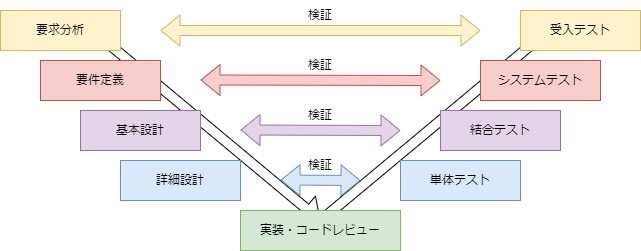

# ソフトウェア開発手法 4

## 前回のおさらい
前回は、基本設計の一つとして、ネットワーク設計を各種ネットワークの種類およびキュリティの重要性とともに学んだ。
今回はV字工程におけるテストについて学んでいく。

V字工程は、ソフトウェア開発の工程をV字に見立てて、上から下への設計と下から上へのテストを対応させることで、ソフトウェアの品質を向上させるための手法である。
理想的には。各工程を進めるにあたって対となるテス項目を同時に作成することが望ましい。テスト項目の文書化が成果物の明確化につながり。仕様の認識違いなどによる後戻り工数の低減を図ることができ、結果として製品の品質向上につながるためである。

## 受入テスト
受入テストは要求分析と対になっているテスト工程である。
要求分析はシステムの目的や用途を明確にし、システムに求める前提条件が定義される。
そのため、受入テストは機能や性能そのものに加え、納入形態、利用形態、保守体制などがシステムが想定通り動作する前提条件を確認し、サービスがスムーズに導入可能かを判断する。

### 受入テストの例
日報管理システムとして、以下の

1. ユーザー毎の日報入力画面
1. 日報検索画面
1. 日報表示画面
1. レポート表示画面

がある場合、受入テストの機能に関する項目としては以下のような項目が考えられる。

1. ユーザー毎の日報入力画面
    - ユーザーが日報を入力できるか
    - 日報の入力内容が保存されるか
    - 日報の入力内容が正しく表示されるか
1. 日報検索画面
    - ユーザー名を指定して日報を検索できるか
    - 日付を指定して日報を検索できるか
    - 検索結果が正しく表示されるか
1. 日報表示画面
    - 日報が正しく表示されるか
    - 日報の内容が正しく表示されるか
1. レポート表示画面
    - レポートが正しく表示されるか
    - レポートをファイルで出力することができるか
    
提供形態：Webアプリケーション
利用形態：社内ネットワークからアクセス可能
保守体制：月次でバックアップを取得し、障害発生時には24時間以内に復旧を行う

## システムテスト
システムテストは、基本設計と対になっているテスト工程である。
基本設計は、システムの構成や機能の詳細を俯瞰して記述するため、システムテストは、システム全体の機能が正しく連携して動作するかを確認するテストを行う。

### システムテストの例
日報管理システムのシステムテストの例としては以下のような項目が考えられる。

1. ネットワークの連携テスト
    1. 通信プロトコルの動作テスト
    1. ネットワークの帯域幅テスト
    1. ネットワークの遅延テスト
    1. セキュリティテスト
1. データベースの連携テスト
    1. データベースの接続テスト
    1. データベースの読み書きテスト
    1. データベースの障害復旧テスト
1. 非機能テスト
    1. レスポンシブデザインのテスト
    1. ユーザビリティテスト
    1. パフォーマンステスト

## 結合テスト
結合テストは、詳細設計と対になっているテスト工程である。
詳細設計は、システムの各要素（モジュール、コンポーネント、サービスなど）間の連携動作を明確に記述するため、結合テストは、各要素が連携して動作することを検証するテストを行う。

### 結合テストの例
日報管理システムの結合テストの例としては以下のような項目が考えられる。

1. ユーザー毎の日報入力画面と日報検索画面の連携テスト
    - 日報入力画面で入力した内容が日報検索画面で検索できるか
1. 日報検索画面と日報表示画面の連携テスト
    - 日報検索画面で検索した内容が日報表示画面で正しく表示されるか
1. 日報表示画面とレポート表示画面の連携テスト
    - 日報表示画面で表示した内容がレポート表示画面で正しく表示されるか

## 次回予告
次回は **要件定義** を実際に手を動かしながら検討していく。