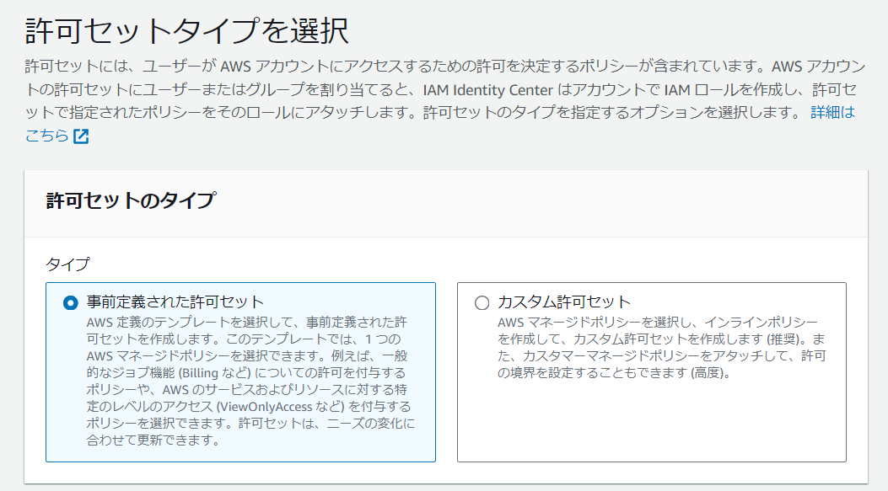

# AWSにおける開発用ユーザ
- 契約時に作成される初期ユーザーはrootユーザーである。rootユーザーは全ての権限を持ち、ユーザーの作成や削除および権限付与、また、請求情報へのアクセス、全サービスの削除も行えてしまう。そのため、rootユーザーは開発用ユーザーとしては適していない。
- 開発用ユーザーはrootユーザーとは別に作成する必要がある。開発用ユーザーはrootユーザーに比べて権限を制限することで、誤操作による被害を最小限に抑えることができる。

## 開発用ユーザーの作成
- 開発用ユーザーはIAM（Identity and Access Management）を用いて作成することができ、ユーザー毎にシークレットキー、アクセスキーが発行される。しかし、しばしば、これらの情報を誤って公開してしまい、不正アクセスを誘発してしまう事故が発生するため、推奨されていない。

ここでは対策を運用で行うのではなく IAM Identity Center を用いて開発用ユーザーを作成する手順を示す。
- IAM Identity Center は、開発用ユーザーの作成、削除、権限付与を行うためのWebアプリケーションであり、シークレットキー、アクセスキーの発行を行わないため、情報漏洩のリスクを軽減することができる他、グループ毎に権限を付与することができるため、権限管理が容易になるメリットもある。

### 許可セットの作成 STEP 1/4
1. IAM Identity Center にアクセスする。

2. 左のメニューから「許可セット」を選択し、「許可セットを作成」をクリックし、「事前定義された許可セット」をクリックする。

3. 事前定義された許可セットの一覧が表示されるので、適切な許可セットを選択し、「次へ」をクリックする。
以下の様な許可セットが用意されているが、必要に応じてカスタム許可セットを作成することもできる。
    - **AdministratorAccess**: 全ての権限を持つ許可セット つまり、rootユーザーと同等の権限
    - **PowerUserAccess**: ほぼrootユーザーと同じ権限を持つが、ユーザーとグループの操作権限が制限される許可セット
    - **ViewOnlyAccess**: AWSのサービスを閲覧のみ可能な許可セット

1.「許可セットの詳細の設定」を必要に応じて編集し、「次へ」をクリックする。
1.「確認して作成」で内容を最終確認し「作成」をクリックする。

### グループの作成 STEP 2/4
1. 左のメニューから「グループ」を選択し、「グループを作成」をクリックする。
1. グループ名を入力し、「グループを作成」をクリックする。

### ユーザーの作成 STEP 3/4
1. 左のメニューから「ユーザー」を選択し、「ユーザーを作成」をクリックする。
1. ユーザー名、Eメールアドレスなどを入力し、「ユーザーを作成」をクリックする。

    - ここで任意ではあるが、「ロケール」と「タイムゾーン」を設定することを推奨する。
    
1. ユーザーを追加したいグループを選択（複数可）し、「次へ」をクリックする。
1. 「ユーザーの確認と追加」で内容を最終確認し、「ユーザーを追加」をクリックする。

### ユーザーの許可セットの割り当て STEP 4/4
1. 左のメニューから「AWSアカウント」を選択し、ユーザー名をクリックする。
1. 「ユーザーまたはグループを割り当て」をクリックする。
1. 「ユーザー」もしくは「グループ」をクリック（複数可）し、を「次へ」をクリックする。
1. 「許可セット」を選択（複数可）し、「送信」をクリックする。

1. ユーザー作成に成功すると、登録したメールアドレスにメールが送信されるので、メール内のリンクをクリックしてパスワードを設定する。

1. パスワードを設定したら、2段階認証を行うためのMFAデバイスの登録を促されるため、利用可能な認証デバイスを選択する。

1. MFAデバイスの登録が完了すると、メールに添付されているURLよりアクセス可能となる
