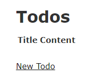
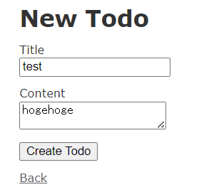
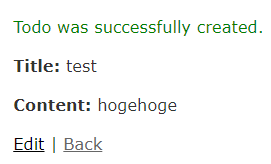
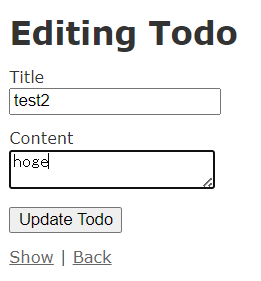
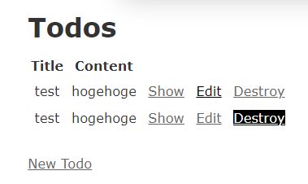
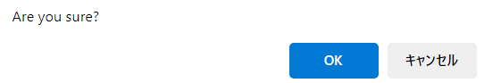

# Ruby on Rails CRUD app

## 1. Hello world 同様 Piza Cloud を利用する。

https://paiza.cloud

## 2. プロジェクトを作成する
- myCRUDApp フォルダ以下にプロジェクトを作成する
このコマンド一発でプロジェクトに必須のファイルやディレクトリが作成される
```bash
$ rails new toDoApp
```

## 3. プロジェクトのディレクトリに移動する
```bash
$ cd toDoApp
```

## 4. rails generate コマンドで scaffold（足場）を作成する
- Todo モデルを作成する
- string 型の title のカラムを作成する
- text 型の content のカラムを作成する
```bash 
$ rails generate scaffold Todo title:string content:text
```
## 5. データベースを作成する
デフォルトのデータベースは SQLite3 であり、db フォルダ以下に development.sqlite3 などのファイルが作成される。
```bash
$ rake db:migrate
```

## 6. サーバーを起動する
```bash
$ rails server
```

## 7. ブラウザでアクセスする
- ブラウザで http://localhost:3000/todos にアクセスする
- Todo モデルの 一覧画面が表示されれば成功
- 最初は何も登録していないため、一覧画面は空になる



## 8. todo を追加する
- New Todo リンクをクリックする
- Title と Content を入力して Create Todo ボタンをクリックする
- 一覧画面に戻り、新しく追加した todo が表示されていれば成功





## 9. todo を編集する
- 一覧画面で Edit リンクをクリックする
- Title や Content を編集して Update Todo ボタンをクリックする
- 一覧画面に戻り、編集した todo が表示されていれば成功



## 10. todo を削除する
- 一覧画面で Destroy リンクをクリックする
- 削除確認画面が表示されるので、OK ボタンをクリックする
- 一覧画面に戻り、削除した todo が表示されていなければ成功



---

