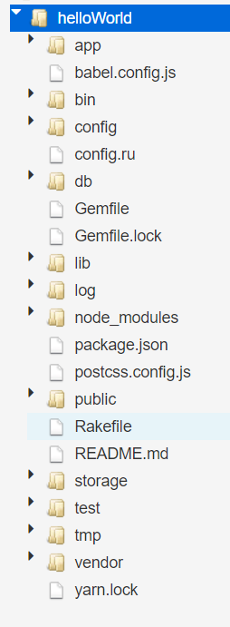

# Ruby on Rails Hello World

## 1. パソコンに Ruby on Rails をインストールする代わりにオンライン実行環境を使うため、Piza Cloud を利用する。

https://paiza.cloud

## 2. プロジェクトを作成する
```bash
$ rails new helloWorld
```

## 3. プロジェクトのディレクトリに移動する
```bash
$ cd helloWorld
```

## 4. サーバーを起動する
```bash
$ rails server
```

## 5. ブラウザでアクセスする
- ブラウザで http://localhost:3000 にアクセスする
- Ruby on Rails のデフォルトページが表示されれば成功


## 参考までに
以下がプロジェクトのディレクトリ構造  
これらが、コマンド一発で生成される。
